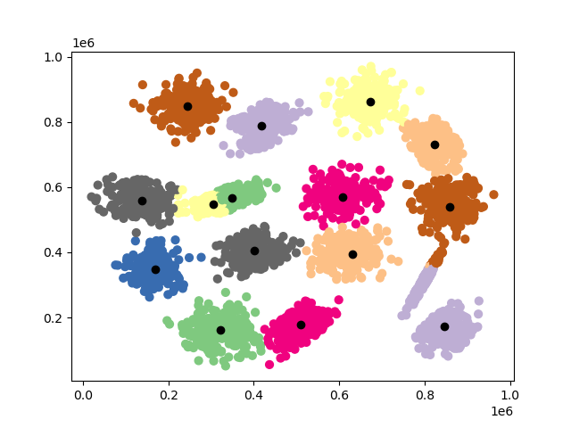

# Podstawy-Cybernetyki #1
Metodą k-średnich przypisać do klastrów punkty z (5 pkt):

• [pliku S1](http://cs.joensuu.fi/sipu/datasets/s1.txt "plik S1") – 2 wymiary i 15 klastrów, aby mieć podstawę do dalszych prac, należy wpisać centra
klusteringu ręcznie, oznaczyć każdy cluster osobnym kolorem;

• [pliku breast](http://cs.joensuu.fi/sipu/datasets/breast.txt "plik breast")– 9 wymiarów, 2 klastry, aby sprawdzić, czy cokolwiek działa trzeba rysować scaterry
3d (dla każdych 3 wymiarów) z kolorem oznaczającym przynależność do grupy.

## Jak postawić projekt
Projekt jest napisany przy wykorzystaniu standardowych modułów Python 3.7 oraz następujących bibliotek:

- numpy
- pandas
- requests
- matplotlib
- scikit-learn
- docutils
- keras
Dla poprania tych bibliotek jedynie trzeba skorzystać z poniższego polecenia.
```commandline
pip install -r requirements.txt
```
## Dostępne komendy

```commandline
usage: main.py [-h] [-n N] [-p] [-l L] [-save] [-km] [-kr] [-som] [-f] [-u {S1,Breast}]

List the options:

optional arguments:
  -h, --help      show this help message and exit
  -n N            number of clusters, default [2], max 15
  -p              Plot results.
  -l L            Learn neural network, epochs number
  -save           Save dana in csv
  -km, --kmeans   Use K-means algorithm
  -kr, --keras    Use neural network from keras libraries
  -som, --som     Use SOM algorithm - Self-organizing feature map
  -f, --fuzzy     Use SOM algorithm - Self-organizing feature map
  -u {S1,Breast}  Data: S1 - get data with 'http://cs.joensuu.fi/sipu/datasets/s1.txt'; Breast - get data with 'http://cs.joensuu.fi/sipu/datasets/breast.txt' ;Default: S1

```

## Algorytmy
### K-means++
Jest to ten samy algorytm ''K-means'' tylko z inteligentnym przydzielaniem centroid.
W celu przetestowania algorytmu używam jedynie flagi ''-km, --kmeans'' z defoltową liczbą podziału
na klastry. Default mamy 15 klastrów dla zmiany liczby używamy flagi ''-n'' oraz liczbę klastrów, jaką potrzebujemy.

```commandline
python main.py -n 15 -km
```

albo
 
```commandline
python main.py -km  -u Breast -p
```


Wyniki możemy zobaczyć poniższych rysunkach:

K_means: klas-15, wymiar-2 | K_means: klas-2, wymiar-9
:-------------------------------------:|:-------------------------:
 | 

### Fuzzy

```commandline
python main.py -n 15 -f -p
```

albo 

```commandline
python main.py -f -u Breast -p
```

Wyniki możemy zobaczyć poniższych rysunkach:

Fuzzy: klas-15, wymiar-2 | Fuzzy: klas-2, wymiar-9
:-------------------------------------:|:-------------------------:
 | 


### Machine learning
Dla sieci nieuronowej używałem bibliotekę ''keras'', data set dla uczenia sieci znajduje się w pliku
''model/K_means_2_9.csv'' oraz ''model/K_means_15_2.csv''.
W celu przetestowania algorytmu używam jedynie flagi ''-kb, --keras'' z defoltową liczbą podziału
na klastry. Default mamy 15 klastrów dla zmiany liczby używamy flagi ''-n'' oraz liczbę klastrów, jaką potrzebujemy.

```commandline
python main.py -n 15 -kr
lub
python main.py -n 15 --keras
```

Wyniki możemy zobaczyć poniższych rysunkach, niestety nie udało się nauczyć sieć:

Keras: klas-15, wymiar-2 | Keras: klas-2, wymiar-9
:-------------------------------------:|:-------------------------:
 | 

### SOM - Self-organizing feature map
Sieć Kohonena – sieć neuronowa uczona w trybie bez nauczyciela w celu wytworzenia niskowymiarowej zdyskretyzowanej reprezentacji przestrzeni wejściowej.
w tym celu urzywam biblioteke ''susi''. Flaga ''-som, --som''.

SOM: klas-15, wymiar-2 | SOM: klas-2, wymiar-9
:-------------------------------------:|:-------------------------:
 | 